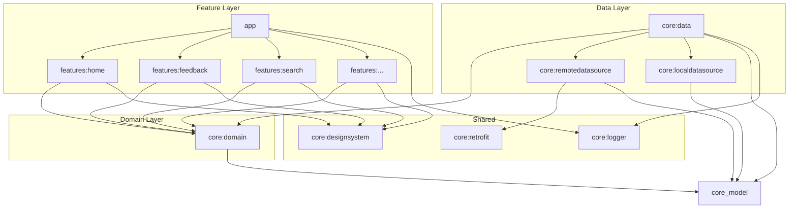

# Depromeet 17th Team5 Android Project Structure

## 1. 모듈 구조 (Module Structure)

오거덩스팀 안드로이드 프로젝트는 Clean Architecture를 기반으로 한 멀티모듈 구조를 채택하고 있습니다. 각 모듈은 기능 및 레이어별로 분리되어 있으며, 이를 통해 코드의 재사용성을 높이고, 빌드 시간을 단축하며, 유지보수를 용이하게 합니다.

```
.
├── app
├── build-logic
├── core
│   ├── data
│   ├── designsystem
│   ├── domain
│   ├── localdatasource
│   ├── logger
│   ├── model
│   ├── remotedatasource
│   └── retrofit
└── features
    ├── feedback
    ├── home
    ├── principle
    ├── reasons
    ├── retrospect
    └── search
```

---

## 2. 의존성 그래프 (Dependency Graph)

모듈 간의 의존성 흐름은 아래와 같습니다. 의존성은 항상 바깥쪽 레이어에서 안쪽 레이어로 향하며, `feature` 모듈 간의 직접적인 의존은 지양합니다.



---

## 3. 모듈 상세 설명 (Module Descriptions)

### `app`
- 애플리케이션의 진입점 역할을 하는 최상위 모듈입니다.
- 모든 `features` 모듈과 `core` 모듈을 통합하고, Dagger Hilt를 사용한 의존성 주입을 설정하여 전체 애플리케이션을 구성합니다.

### `build-logic`
- Gradle Convention Plugin을 사용하여 모듈별 Gradle 설정을 중앙에서 관리합니다. 이를 통해 여러 모듈에 걸쳐 일관된 의존성 버전 관리와 플러그인 설정을 유지합니다.

### `core`
- 여러 모듈에서 공통으로 사용되는 코드를 포함하는 그룹입니다.
- **`core:data`**: 데이터 소스(Remote, Local)와의 상호작용을 담당합니다. `core:domain` 모듈의 Repository 인터페이스에 대한 구현체를 포함합니다.
- **`core:designsystem`**: 공통으로 사용되는 Composable UI 컴포넌트, Color, Typography, Icon 등을 정의합니다.
- **`core:domain`**: 순수한 Kotlin 모듈로, 비즈니스 로직(UseCase)과 데이터 계층을 정의하는 Repository 인터페이스를 포함합니다. 안드로이드 프레임워크에 대한 의존성이 없습니다.
- **`core:localdatasource`**: Room DB, DataStore 등 로컬 데이터 소스와의 통신을 담당합니다.
- **`core:logger`**: Timber와 같은 로깅 관련 유틸리티를 포함합니다.
- **`core:remotedatasource`**: Remote API 등 원격 데이터 소스와의 통신을 담당합니다.
- **`core:retrofit`**: Retrofit 인스턴스 생성 및 네트워크 통신 관련 설정을 담당합니다.

### `features`
- 각 기능 단위로 분리된 독립적인 모듈 그룹입니다.
- 각 `feature` 모듈은 독립적으로 작동할 수 있으며, 화면(UI), 상태 관리(ViewModel) 로직을 포함합니다.
- `core:domain`, `core:designsystem` 등 공통 모듈에 의존하여 기능을 구현합니다.

---

## 4. 데이터 매핑 구조 (Data Mapping Structure)

본 프로젝트는 각 레이어 간의 의존성을 분리하고 데이터 흐름을 명확히 하기 위해 계층별 데이터 모델과 Mapper 인터페이스를 사용합니다. 데이터는 `Retrofit(DTO)` -> `RemoteDataSource` -> `Data` -> `Domain` -> `Feature(UI Model)` 순서로 흐르며, 각 단계에서 필요한 모델로 변환됩니다.

```mermaid
graph LR
    subgraph core:retrofit
        A[SearchResponse]
    end
    subgraph core:remotedatasource
        B[SearchRemoteData]
    end
    subgraph core:data
        C[SearchData]
    end
    subgraph core:domain
        D[Search]
    end
    subgraph features
        E[Search (UI Model)]
    end

    A -- toRemoteData() --> B
    B -- toData() --> C
    C -- toDomain() --> D
    D -- toUiModel() --> E
```

### Mapper 인터페이스

-   **`core:retrofit`**
    -   `RetrofitMapper<T>`: `Retrofit`의 Response DTO 모델을 `RemoteDataSource` 모델로 변환합니다.
    -   `fun toRemoteData(): T`
-   **`core:remotedatasource`**
    -   `RemoteDataMapper<T>`: `RemoteDataSource` 모델을 `Data` 모델로 변환합니다.
    -   `fun toData(): T`
-   **`core:data`**
    -   `DataMapper<T>`: `Data` 모델을 `Domain`의 모델로 변환합니다.
    -   `fun toDomain(): T`
-   **`core:domain`**
    -   `DomainMapper<T>`: `Domain`의 모델을 `Feature` 레이어에서 사용하는 UI 모델로 변환합니다.
    -   `fun toUiModel(): T`
